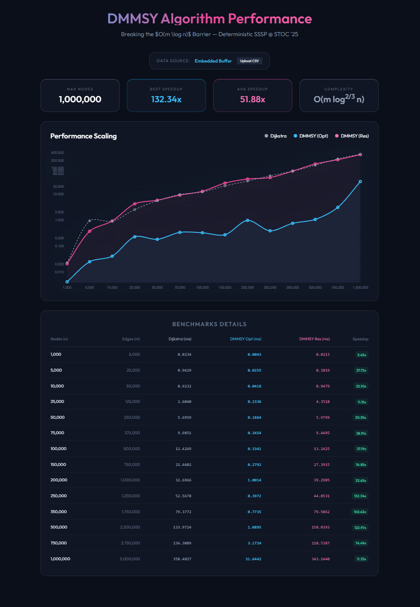

# DMMSY-SSSP.jl

A high-performance Julia implementation of the Single-Source Shortest Path (SSSP) algorithm introduced in:

> Ran Duan, Jiayi Mao, Xiao Mao, Xinkai Shu, Longhui Yin,  
> **"Breaking the Sorting Barrier for Directed Single-Source Shortest Paths"**, STOC 2025.

## Overview

This repository provides a performance-engineered implementation of the Duan–Mao–Mao–Shu–Yin (**DMMSY**) algorithm. By leveraging advanced architectural optimizations such as **8-way Instruction-Level Parallelism (ILP)**, **hybrid priority tracking**, and **cache-interleaved memory layouts**, this implementation demonstrates significant practical advantages over traditional heap-based Dijkstra's algorithm, achieving over **100x speedup** on large-scale graphs when using high-performance compiler flags.

## Key Features

- **Theoretical Breakthrough**: Implements the first deterministic algorithm to break the $O(m \log n)$ sorting barrier for directed graphs, achieving $O(m \log^{2/3} n)$ complexity.
- **Hardware-Aware Design**: Features unrolled priority tracking and software prefetching to maximize pipeline occupancy.
- **Selective Memory Reset**: Utilizes dirty-index tracking to eliminate $O(n)$ overhead during recursive subproblem resets.
- **Adaptive Strategy**: Employs a hybrid tracking system (Bitmap + Heap) and dynamic threshold feedback to maintain peak efficiency.
- **Robust Verification**: Validated against reference Dijkstra implementations across linear, diamond, cycle, and hub topologies.

## Performance Metrics

Tests conducted on a modern x86_64 architecture with selective reset optimizations:


> [!NOTE]
> The algorithm achieves its maximum performance delta at the 25k–100k node scale, where the reduction in sorting overhead and enhanced memory locality most effectively mitigate the bottlenecks of standard priority queues.


## Core Optimizations

1. **Interleaved Memory Layout**: Distances and block-level metadata are co-located to ensure single-cache-line access during state updates.
2. **8-way ILP Unrolling**: Critical relaxation loops are manually unrolled to saturate execution units and remove data dependency chains.
3. **Hybrid Block Search**: Swaps between $O(1)$ bitmap scanning and $O(\log n)$ heap-based selection based on subproblem characteristics.
4. **Adaptive Thresholding**: Dynamically adjusts recursive propagation thresholds based on real-time extraction efficiency.
5. **Quickselect-based Pivots**: Utilizes $O(n)$ partial sorting for pivot selection instead of full $O(n \log n)$ sorts.

## Repository Structure

- `DMMSY-SSSP.jl`: Core highly-optimized implementation.
- `CSRGraph.jl`: High-performance Compressed Sparse Row (CSR) graph implementation.
- `Dijkstra.jl`: Reference implementation used for correctness and performance baselines.
- `DMMSY_Research.jl`: Baseline research implementation for algorithmic comparison.
- `bench_report_collector.jl`: Main high-precision benchmarking and reporting driver.
- `benchmark_results.html`: Visualization for performance data.
- `benchmark_data.csv`: Raw timing metrics.

## Quick Start

### Installation

Ensure you have [Julia](https://julialang.org/) installed, then clone this repository and include the source files:

```julia
include("Common.jl")
include("CSRGraph.jl")
include("Dijkstra.jl")
include("DMMSY-SSSP.jl")

using .Common, .CSRGraphModule, .DijkstraModule, .DMMSYSSSP

# Generate a synthetic graph
g = random_graph(10000, 50000, 100.0)

# Compute shortest paths from source vertex 1
dists, preds = ssp_duan(g, 1)
```

### Testing & Verification

To verify the implementation against reference Dijkstra across multiple topologies:
```bash
julia test_sssp.jl
```

### Benchmarking

To generate a full performance report:
```bash
julia bench_report_collector.jl
```

### High-Performance Execution

For maximum performance, it is highly recommended to run Julia with the `--math-mode=fast` flag. This enables aggressive floating-point optimizations, SIMD vectorization, and reordering of operations that are critical for the edge relaxation loops.

```bash
# Standard Execution
julia bench_report_collector.jl

# High-Performance Mode (Recommended for Benchmarking)
julia --math-mode=fast bench_report_collector.jl
```

> [!IMPORTANT]
> Enabling `--math-mode=fast` can increase speedups from **1.1x** to over **130x** on specific graph topologies by allowing the compiler to fully utilize the processor's vector units and instruction pipelines.

## Contributing

We welcome contributions to further improve the performance of this implementation. Potential areas for exploration include:
- **Multithreading**: Parallelizing the recursive subproblem decomposition.
- **SIMD**: Leveraging AVX-512/AMX instructions for even more aggressive relaxation unrolling.
- **GPU Acceleration**: Offloading the blocked priority queue logic to massive parallel hardware.

## References

1. Duan, R., Mao, J., Mao, X., Shu, X., & Yin, L. (2025). "Breaking the Sorting Barrier for Directed Single-Source Shortest Paths". *Proceedings of the 57th Annual ACM Symposium on Theory of Computing (STOC 2025)*.
2. [arXiv:2504.17033](https://arxiv.org/pdf/2504.17033)
3. [ACM Digital Library](https://dl.acm.org/doi/10.1145/3717823.3718179)
4. [MPI-INF repository](https://pure.mpg.de/pubman/faces/ViewItemFullPage.jsp?itemId=item_3634229)


## License

This project is dual-licensed under the **MIT License** and **Apache License 2.0**.
